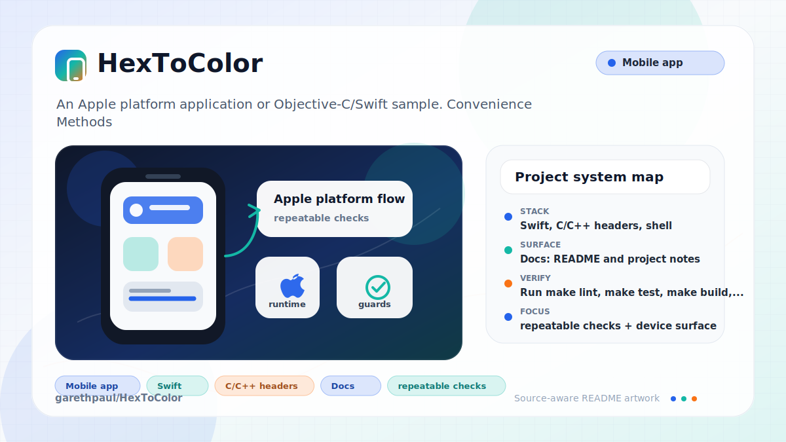

# HexToColor

<!-- README-OVERVIEW-IMAGE -->


## Overview

`garethpaul/HexToColor` is an Apple platform application or Objective-C/Swift sample. Convenience Methods for UIColor

This README is based on the checked-in source, manifests, scripts, and repository metadata on the `master` branch. The project language mix found during review was: Swift (2), C/C++ headers (1), shell (1).

## Repository Contents

- `CHANGES.md` - concise history of maintenance changes
- `Makefile` - local verification entry point
- `README.md` - project overview and local usage notes
- `build.sh`
- `HexToColor` - source or example code
- `HexToColor.xcodeproj` - Xcode project file
- `HexToColorTests` - source or example code
- `HexToColor.podspec` - CocoaPods metadata
- `scripts/check-baseline.py` - static parser and Xcode metadata checks
- `SECURITY.md` - security reporting and disclosure guidance
- `VISION.md` - project direction and maintenance guardrails

Additional scan context:

- Source directories: HexToColor, HexToColorTests
- Dependency and build manifests: HexToColor.podspec
- Entry points or build surfaces: Makefile, build.sh, HexToColor.xcodeproj
- Test-looking files: HexToColorTests/HexToColorTests.swift, HexToColorTests/Info.plist

## Getting Started

### Prerequisites

- Git
- macOS with Xcode for building Apple platform projects

### Setup

```bash
git clone https://github.com/garethpaul/HexToColor.git
cd HexToColor
```

The setup commands above are derived from repository files. Legacy mobile, Python, or JavaScript samples may require older SDKs or package versions than a modern workstation uses by default.

## Running or Using the Project

- Open `HexToColor.xcodeproj` in Xcode, choose the app or sample scheme, and run it on the matching simulator/device.
- Run `./build.sh` when the required platform toolchain is installed.

## Testing and Verification

- Run `make lint`, `make test`, `make build`, and `make check` for static
  parser, plist, podspec, build-script, and Xcode project guardrails that do not
  require Xcode. The `lint`, `test`, and `build` targets currently delegate to
  the static baseline.
- Xcode's test action or `xcodebuild test` with the appropriate scheme and destination
- The public Swift API is `toColor(hex:)`; surrounding whitespace is trimmed,
  `#RGB`, `#RGBA`, `#RRGGBB`, `#RRGGBBAA`, `RRGGBB`, and `0xRRGGBB`
  values are supported. `#0xRRGGBB` is normalized through the same RGB parsing
  path. RGB alpha defaults to opaque, and invalid hex strings fall back to
  `UIColor.grayColor()`. Signed or otherwise non-hex characters are rejected
  before scanner conversion.

When the required SDK or runtime is unavailable, use static checks and source review first, then verify on a machine that has the matching platform toolchain.

## Configuration and Secrets

- No required secret or credential file was identified in the repository scan. If you add integrations later, keep secrets out of git.

## Security and Privacy Notes

- Review changes touching network requests, sockets, or service endpoints; examples from the scan include HexToColor/Info.plist, HexToColorTests/Info.plist.
- Review changes touching file, media, JSON, XML, CSV, OCR, or data parsing; examples from the scan include HexToColor/Info.plist, HexToColorTests/Info.plist.

## Maintenance Notes

- This looks like an Apple platform project or sample. Xcode, Swift, CocoaPods, and deployment target versions may need to match the original project era.
- Set `IOS_SIMULATOR_NAME` or `IOS_DESTINATION` when `./build.sh` needs a simulator different from the legacy default.
- See `SECURITY.md` for vulnerability reporting and safe research guidance.
- See `VISION.md` for project direction and contribution guardrails.
- See `docs/plans/2026-06-08-hextocolor-whitespace-baseline.md` for the current whitespace parsing guardrail.
- See `docs/plans/2026-06-08-hextocolor-zero-x-prefix.md` for the current `0x` prefix parsing guardrail.
- See `docs/plans/2026-06-09-hextocolor-rgb-shorthand.md` for the current shorthand parsing guardrail.
- See `docs/plans/2026-06-09-hextocolor-signed-character-guard.md` for the current signed-character parsing guardrail.
- See `docs/plans/2026-06-09-hextocolor-hash-zero-x-prefix.md` for the current
  hash-prefixed `0x` normalization guardrail.
- See `docs/plans/2026-06-09-make-gate-aliases.md` for local verification
  target guardrails.

## Contributing

Keep changes small and tied to the project that is already present in this repository. For code changes, document the toolchain used, avoid committing generated dependency directories or local configuration, and update this README when setup or verification steps change.
